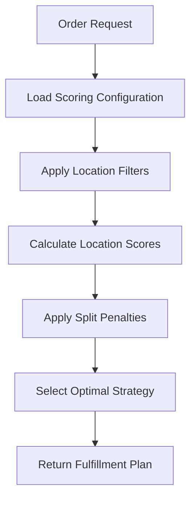

# Business Configuration Guide: Dynamic Order Sourcing with Configurable Scoring

## Overview

The Order Sourcing Engine provides a powerful **Configurable Scoring System** that allows businesses to dynamically adjust how locations are selected for order fulfillment. Instead of relying on hard-coded business rules, the system enables real-time configuration of scoring weights to optimize for different business scenarios, product types, and market conditions.

## 🎯 Key Business Benefits

### 1. **Dynamic Business Rule Management**
- **No Code Deployments Required**: Change scoring logic instantly through database configuration
- **Real-time Adaptation**: Respond to market changes, seasonal demands, or operational constraints immediately
- **A/B Testing Capability**: Test different scoring strategies simultaneously to optimize performance

### 2. **Product-Specific Optimization**
- **Category-Based Scoring**: Different rules for electronics, groceries, hazmat, high-value items
- **Custom Weightings**: Tailor location selection criteria for specific product characteristics
- **Compliance Integration**: Built-in support for regulatory requirements (hazmat, cold chain, etc.)

### 3. **Operational Flexibility**
- **Peak Season Adjustments**: Automatically adjust for capacity constraints during high-demand periods
- **Cost Optimization**: Balance between speed, cost, and reliability based on business priorities
- **Performance Monitoring**: Track how different configurations impact KPIs like delivery time and cost

## 🏗️ System Architecture & Key Features

### **Core Components**

#### **1. Configurable Scoring Engine**
- **20+ Configurable Parameters**: Transit time, inventory levels, processing capacity, distance, value thresholds
- **Multi-factor Scoring**: Combines location capabilities, inventory availability, and business constraints
- **Script-Based Logic**: Advanced users can write custom scoring algorithms using AviatorScript

#### **2. Location Filtering System**
- **Rule-Based Filtering**: Pre-filter locations based on delivery type, product requirements, compliance needs
- **Dynamic Context**: Scripts have access to order details, location capabilities, time factors, and business context
- **Performance Optimized**: Multi-level caching with intelligent pre-computation

#### **3. Split Penalty Management**
- **Configurable Penalties**: Adjust costs for splitting orders across multiple locations
- **Value-Based Logic**: Higher penalties for expensive items that customers prefer in single shipments
- **Urgency Factors**: Additional penalties for express deliveries to minimize complexity

#### **4. Real-time API Integration**
- **REST APIs**: Easy integration with e-commerce platforms, OMS, and WMS systems
- **Sub-second Response Times**: Optimized for real-time order processing and PDP page requests
- **Comprehensive Response Data**: Detailed scoring breakdown, alternative options, and confidence metrics

### **How It Works**



1. **Configuration Loading**: System loads appropriate scoring configuration based on order item properties
2. **Location Filtering**: Pre-filters locations using AviatorScript rules (distance, capabilities, compliance)
3. **Score Calculation**: Applies configurable weights to factors like transit time, inventory, processing capacity
4. **Strategy Optimization**: Evaluates single-location vs multi-location strategies with penalty calculations
5. **Decision Output**: Returns optimal fulfillment plan with detailed scoring rationale

## 📊 Business Configuration Examples

### **Example 1: E-commerce Electronics Retailer**

**Business Challenge**: High-value electronics require secure handling and fast delivery, but cost optimization is crucial for competitive pricing.

**Configuration Strategy**: `ELECTRONICS_PREMIUM_SCORING`

#### **Key Factors & Weightings**:
- **Transit Time Weight**: -15.0 (vs -10.0 default)
  - *Business Logic*: Electronics customers expect fast delivery; heavily penalize distant locations
- **Inventory Weight**: +60.0 (vs +50.0 default)
  - *Business Logic*: Prefer locations with high stock levels to avoid stockouts on popular items
- **High Value Threshold**: $1000 (vs $500 default)
  - *Business Logic*: Apply extra security measures for premium electronics
- **Split Penalty Base**: 20.0 (vs 15.0 default)
  - *Business Logic*: Customers prefer single shipment for electronics purchases

#### **Business Impact**:
```
Scenario: Customer orders iPhone 15 Pro ($1299) from NYC

DEFAULT_SCORING Results:
├── Brooklyn Warehouse (2 days): Score 20.0 ⭐ Selected
├── Manhattan Store (1 day): Score 35.0 
└── Newark DC (3 days): Score 10.0

ELECTRONICS_PREMIUM_SCORING Results:
├── Brooklyn Warehouse (2 days): Score 14.0
├── Manhattan Store (1 day): Score 37.0 ⭐ Selected  
└── Newark DC (3 days): Score -1.0
```

**Outcome**: Customer receives iPhone next day instead of 2 days, improving satisfaction and reducing return risk.

### **Example 2: Grocery Chain with Fresh & Frozen Products**

**Business Challenge**: Fresh and frozen items require specialized cold-chain handling with strict delivery timeframes, while managing operational costs.

**Configuration Strategy**: `COLD_CHAIN_OPTIMIZED_SCORING`

#### **Key Factors & Weightings**:
- **Distance Weight**: -1.0 (vs -0.5 default)
  - *Business Logic*: Cold chain integrity degrades with distance; minimize transport time
- **Processing Time Weight**: -10.0 (vs -5.0 default)
  - *Business Logic*: Longer processing increases spoilage risk for perishables
- **Same Day Penalty**: 5.0 (vs 25.0 default)
  - *Business Logic*: Encourage same-day delivery for fresh items to reduce waste
- **Custom Scoring Script**: 
  ```javascript
  base = location.transitTime * scoring.transitTimeWeight + 
         inventory.ratio * scoring.inventoryWeight;
  
  // Boost for cold-chain certified locations
  if (location.hasColdChain && order.requiresColdStorage) {
      base += 25.0;
  }
  
  // Penalty for non-certified locations handling cold items
  if (!location.hasColdChain && order.requiresColdStorage) {
      base -= 50.0;
  }
  
  return base;
  ```

#### **Business Impact**:
```
Scenario: Customer orders frozen pizza + fresh produce from suburban Chicago

STANDARD_SCORING Results:
├── Suburban Store (no cold chain): Score 15.0 ⭐ Selected
├── Cold Storage DC (1 day): Score 10.0
└── Regional Hub (2 days): Score 5.0

COLD_CHAIN_OPTIMIZED_SCORING Results:
├── Suburban Store (no cold chain): Score -35.0 (disqualified)
├── Cold Storage DC (1 day): Score 35.0 ⭐ Selected
└── Regional Hub (2 days): Score -45.0 (disqualified)
```

**Outcome**: Order ships from certified cold storage facility, ensuring product quality and compliance with food safety regulations.

### **Example 3: B2B Industrial Supplier**

**Business Challenge**: Industrial customers prioritize reliability and cost over speed, with tolerance for multi-location shipments if it reduces costs.

**Configuration Strategy**: `B2B_COST_OPTIMIZED_SCORING`

#### **Key Factors & Weightings**:
- **Transit Time Weight**: -5.0 (vs -10.0 default)
  - *Business Logic*: B2B customers more flexible on delivery time in exchange for lower costs
- **Split Penalty Base**: 5.0 (vs 15.0 default)
  - *Business Logic*: B2B customers accept multiple shipments to optimize inventory costs
- **Inventory Weight**: +75.0 (vs +50.0 default)
  - *Business Logic*: Strongly prefer locations with high stock to fulfill large quantity orders
- **Distance Threshold**: 200km (vs 100km default)
  - *Business Logic*: Willing to ship from farther locations for better pricing

#### **Business Impact**:
```
Scenario: Manufacturing company orders 100 units of industrial equipment

STANDARD_SCORING Results:
Single Location Strategy:
├── Local Warehouse (50 units): Score 25.0, PARTIAL fulfillment
└── Split Penalty: N/A

Multi-Location Strategy:
├── Local Warehouse (50 units): Score 25.0
├── Regional DC (50 units): Score 15.0  
└── Split Penalty: -15.0
└── Total Score: 25.0 ⭐ Selected (partial fulfillment)

B2B_COST_OPTIMIZED_SCORING Results:
Single Location Strategy:
├── Local Warehouse (50 units): Score 37.5, PARTIAL fulfillment

Multi-Location Strategy:
├── Local Warehouse (50 units): Score 37.5
├── Regional DC (50 units): Score 27.5
└── Split Penalty: -5.0
└── Total Score: 60.0 ⭐ Selected (full fulfillment)
```

**Outcome**: Customer receives complete order via two shipments at lower total cost, meeting B2B preference for complete fulfillment over speed.

## 🛠️ Configuration Management

### **Available Scoring Configurations**

| Configuration ID | Target Use Case | Key Characteristics |
|-----------------|----------------|-------------------|
| `DEFAULT_SCORING` | General e-commerce | Balanced speed/cost optimization |
| `ELECTRONICS_PREMIUM_SCORING` | High-value electronics | Speed + security focused |
| `EXPRESS_DELIVERY_SCORING` | Same/next-day delivery | Distance minimization |
| `HAZMAT_SCORING` | Hazardous materials | Compliance + safety first |

### **Configuration Parameters**

#### **Location Scoring Weights**
- **transitTimeWeight**: Penalty per day of transit time (typically negative)
- **processingTimeWeight**: Penalty per hour of processing time (typically negative)
- **inventoryWeight**: Bonus for inventory availability ratio (typically positive)
- **expressWeight**: Bonus for express-capable locations (typically positive)
- **distanceWeight**: Penalty per kilometer distance (typically negative)

#### **Split Penalty Configuration**
- **splitPenaltyBase**: Base penalty for using multiple locations
- **splitPenaltyExponent**: Exponential growth factor for additional locations
- **splitPenaltyMultiplier**: Multiplier for exponential penalty calculation

#### **Value & Urgency Adjustments**
- **highValueThreshold**: Dollar threshold for high-value item handling
- **highValuePenalty**: Additional penalty for splitting high-value orders
- **sameDayPenalty**: Additional penalty for same-day delivery complexity
- **nextDayPenalty**: Additional penalty for next-day delivery complexity

#### **Confidence Scoring**
- **baseConfidence**: Starting confidence level (0.0 to 1.0)
- **peakSeasonAdjustment**: Confidence reduction during peak periods
- **weatherAdjustment**: Confidence reduction during weather events
- **hazmatAdjustment**: Confidence reduction for hazardous materials

### **API Integration**

#### **Get Available Configurations**
```bash
GET /api/sourcing/scoring-configurations
```

#### **Use Configuration in Order Sourcing**
```bash
POST /api/sourcing/source-direct
{
  "orderItems": [{
    "sku": "PRODUCT123",
    "scoringConfigurationId": "ELECTRONICS_PREMIUM_SCORING",
    ...
  }]
}
```

#### **Monitor Configuration Performance**
```bash
GET /api/sourcing/scoring-configurations/ELECTRONICS_PREMIUM_SCORING
```

## 📈 Business Optimization Strategies

### **Seasonal Adjustments**
- **Peak Season**: Increase split penalties to reduce operational complexity
- **Low Demand**: Decrease transit time weights to optimize for cost over speed
- **Holiday Rush**: Boost express weights to prioritize fast-turnaround locations

### **Product Category Optimization**
- **Electronics**: High inventory weights + low split penalties for security
- **Groceries**: Distance minimization + cold chain requirements
- **Industrial**: Cost optimization + flexible delivery timelines

### **Geographic Considerations**
- **Urban Areas**: Prioritize local stores for same-day delivery
- **Rural Areas**: Accept longer transit times for coverage
- **International**: Compliance and documentation requirements

### **Performance Monitoring KPIs**

| Metric | Configuration Impact | Optimization Strategy |
|--------|---------------------|---------------------|
| **Average Delivery Time** | Transit time weights | Increase weights to prioritize closer locations |
| **Fulfillment Rate** | Inventory weights | Increase weights to prefer high-stock locations |
| **Shipping Costs** | Split penalties | Adjust penalties based on cost vs. complexity trade-offs |
| **Customer Satisfaction** | Express weights | Boost for premium customers or high-value items |

## 🚀 Getting Started

### **Step 1: Assess Current Performance**
- Analyze current fulfillment patterns and pain points
- Identify key business metrics to optimize (speed, cost, reliability)
- Review product categories and their specific requirements

### **Step 2: Configure Scoring Strategy**
- Start with existing configurations that match your use case
- Gradually adjust weights based on business priorities
- Test changes with A/B testing approach

### **Step 3: Monitor & Optimize**
- Track KPI changes after configuration adjustments
- Collect feedback from operations and customer service teams
- Iterate based on seasonal patterns and business evolution

### **Step 4: Advanced Customization**
- Implement custom scoring scripts for complex business logic
- Integrate with external systems (weather, traffic, inventory forecasts)
- Develop category-specific configurations for different product lines

## 🎯 Success Metrics

### **Operational Metrics**
- **Fulfillment Rate**: % of orders completely fulfilled from preferred locations
- **Average Delivery Time**: Time from order to customer delivery
- **Shipping Cost per Order**: Total logistics cost including splits and expedites
- **Inventory Turnover**: Utilization of high-inventory locations

### **Customer Experience Metrics**
- **Delivery Promise Accuracy**: % of orders delivered on promised date
- **Customer Satisfaction Score**: Feedback on delivery experience
- **Return Rate**: Impact of delivery speed/quality on returns
- **Repeat Purchase Rate**: Customer loyalty based on fulfillment experience

### **Business Intelligence**
- **Configuration Performance**: ROI of different scoring strategies
- **Seasonal Optimization**: Performance variations by time period
- **Geographic Analysis**: Regional differences in optimal configurations
- **Product Category Insights**: Category-specific optimization opportunities

---

*The Configurable Scoring System transforms order fulfillment from a static, one-size-fits-all approach to a dynamic, business-intelligent system that adapts to your specific needs and continuously optimizes for your key performance indicators.*