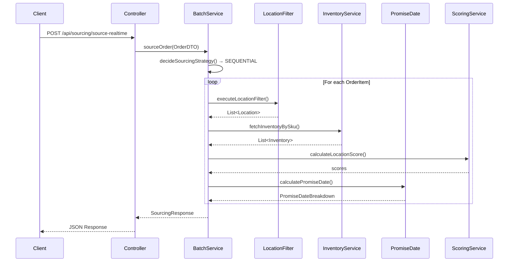
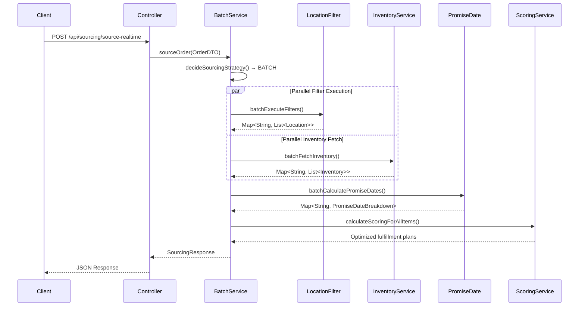
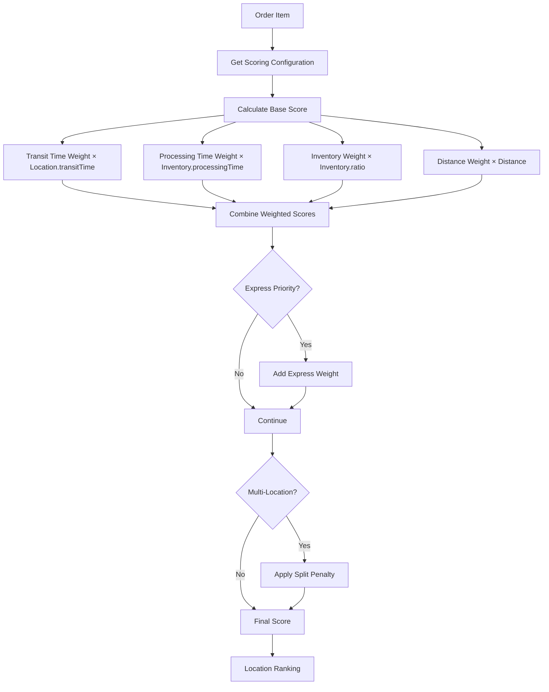
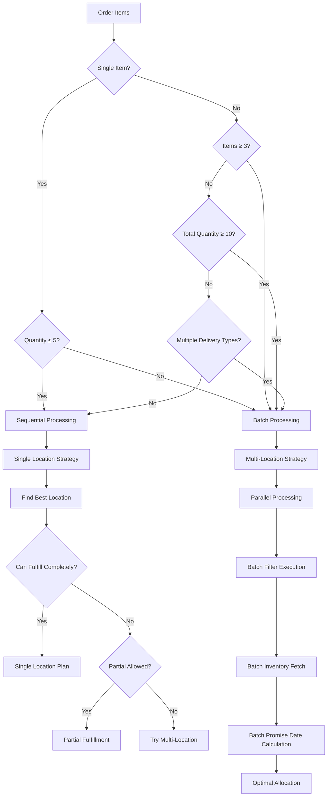

# Order Sourcing Engine - Project Architecture and Flows

## Project Overview

The Order Sourcing Engine is a sophisticated Spring Boot application designed to optimize order fulfillment by intelligently selecting the best locations to fulfill customer orders. It achieves **sub-50ms response times** through advanced caching, configurable scoring systems, and intelligent batch processing strategies.

## Technology Stack

- **Framework**: Spring Boot 3.1.0
- **Language**: Java 17
- **Database**: H2 (in-memory) / PostgreSQL
- **ORM**: JPA/Hibernate
- **Rule Engine**: AviatorScript 5.3.3
- **Build Tool**: Maven
- **Caching**: Spring Cache with concurrent maps
- **Validation**: Bean Validation (JSR-303)

## Core Architecture Components

### 1. **Controller Layer**
- **SourcingController**: Main REST API endpoint handler
  - `/api/sourcing/source-realtime` - Real-time order sourcing
  - `/api/sourcing/source-direct` - Direct order sourcing with DTO
  - `/api/sourcing/source` - Legacy order sourcing by ID
  - Health check and validation endpoints

### 2. **Service Layer**
- **BatchSourcingService**: Core orchestration service with intelligent batch/sequential processing
- **LocationFilterExecutionService**: Manages location filtering using AviatorScript rules
- **InventoryApiService**: Handles inventory data retrieval (database-based)
- **PromiseDateService**: Calculates delivery promise dates
- **ScoringConfigurationService**: Manages configurable scoring weights and penalties
- **CarrierService**: Handles carrier configuration and routing

### 3. **Data Layer**
- **Repositories**: JPA repositories for all entities
- **Models**: Location, Inventory, Order, CarrierConfiguration, ScoringConfiguration
- **DTOs**: Request/Response objects for API communication

### 4. **Configuration Layer**
- **CacheConfig**: Configures Spring Cache for performance optimization
- **Application Properties**: Database, caching, and performance settings

## Key Features

### 1. **Intelligent Processing Strategy**
The system automatically decides between batch and sequential processing based on:
- Number of items (≥3 items → batch processing)
- Total quantity (≥10 units → batch processing)
- Multiple delivery types → batch processing
- Order complexity → batch processing

### 2. **Configurable Scoring System**
Multiple scoring configurations for different scenarios:
- **Default Scoring**: Standard fulfillment weights
- **Electronics Premium**: High-value electronics with security requirements
- **Express Delivery**: Optimized for same-day/next-day delivery
- **Hazmat**: Specialized handling for hazardous materials

### 3. **Advanced Location Filtering**
Dynamic location filtering using AviatorScript expressions:
- Distance-based filtering
- Security requirements
- Capacity constraints
- Delivery type compatibility

### 4. **Multi-Location Fulfillment**
Supports both single and multi-location strategies:
- Partial fulfillment handling
- Split shipment penalties
- Backorder management
- Inventory allocation optimization

## Database Schema

### Core Entities

#### Location
```sql
CREATE TABLE location (
    id INTEGER PRIMARY KEY,
    name VARCHAR(255),
    transit_time INTEGER,
    country VARCHAR(100),
    city VARCHAR(100),
    state VARCHAR(100),
    latitude DOUBLE,
    longitude DOUBLE
);
```

#### Inventory
```sql
CREATE TABLE inventory (
    id INTEGER PRIMARY KEY,
    location_id INTEGER,
    sku VARCHAR(255),
    quantity INTEGER,
    processing_time INTEGER,
    FOREIGN KEY (location_id) REFERENCES location(id)
);
```

#### Order
```sql
CREATE TABLE orders (
    id INTEGER PRIMARY KEY,
    order_id VARCHAR(255),
    latitude DOUBLE,
    longitude DOUBLE
);
```

#### ScoringConfiguration
```sql
CREATE TABLE scoring_configuration (
    id VARCHAR(255) PRIMARY KEY,
    name VARCHAR(255),
    description TEXT,
    is_active BOOLEAN,
    transit_time_weight DOUBLE,
    processing_time_weight DOUBLE,
    inventory_weight DOUBLE,
    express_weight DOUBLE,
    split_penalty_base DOUBLE,
    -- Additional scoring parameters...
);
```

#### LocationFilter
```sql
CREATE TABLE location_filter (
    id VARCHAR(255) PRIMARY KEY,
    name VARCHAR(255),
    description TEXT,
    filter_script TEXT,
    is_active BOOLEAN,
    execution_priority INTEGER,
    cache_ttl_minutes INTEGER
);
```

## API Flow Examples

### 1. **Single Item Order (PDP) - Sequential Processing**



**Expected Response Time**: 30-80ms

### 2. **Multi-Item Order - Batch Processing**



**Expected Response Time**: 80-150ms

### 3. **Location Scoring Algorithm Flow**



## Fulfillment Strategy Decision Tree



## Performance Optimization Strategies

### 1. **Caching Strategy**
- **Expression Cache**: Compiled AviatorScript expressions
- **Location Filter Cache**: Filtered location results (TTL: 30-120 minutes)
- **Scoring Configuration Cache**: Scoring weights and rules
- **Inventory Cache**: Frequently accessed inventory data

### 2. **Batch Processing Optimization**
- **Parallel Execution**: Location filtering and inventory fetching run concurrently
- **Deduplication**: Eliminate duplicate filter executions for same filter IDs
- **Connection Pooling**: Efficient database connection management
- **Result Streaming**: Process results as they arrive

### 3. **Database Optimization**
- **Indexed Queries**: Optimized inventory lookups by SKU and quantity
- **Batch Queries**: Minimize database round trips
- **Connection Pooling**: Efficient resource utilization
- **Query Optimization**: Efficient joins and filtering

## Configuration Examples

### Sample OrderDTO for Real-time Sourcing

```json
{
  "tempOrderId": "ORDER_12345",
  "latitude": 40.7128,
  "longitude": -74.0060,
  "orderItems": [
    {
      "sku": "PHONE123",
      "quantity": 2,
      "deliveryType": "SAME_DAY",
      "locationFilterId": "SDD_FILTER_RULE",
      "allowPartialFulfillment": true,
      "preferSingleLocation": false,
      "scoringConfigurationId": "ELECTRONICS_PREMIUM_SCORING"
    }
  ],
  "customerId": "CUST_001",
  "customerTier": "PREMIUM",
  "allowPartialShipments": true,
  "preferSingleLocation": true,
  "orderType": "WEB",
  "orderPriority": 1
}
```

### Sample SourcingResponse

```json
{
  "tempOrderId": "ORDER_12345",
  "fulfillmentPlans": [
    {
      "sku": "PHONE123",
      "requestedQuantity": 2,
      "totalFulfilled": 2,
      "remainingQuantity": 0,
      "isPartialFulfillment": false,
      "isMultiLocationFulfillment": false,
      "recommendedStrategy": "SINGLE_LOCATION",
      "overallScore": 85.5,
      "splitPenalty": 0.0,
      "locationFulfillments": [
        {
          "location": {
            "id": 1,
            "name": "Downtown Warehouse",
            "type": "WAREHOUSE",
            "transitTimeDays": 1,
            "processingTimeHours": 24,
            "distanceFromCustomer": 8.7
          },
          "availableInventory": 50,
          "allocatedQuantity": 2,
          "canFulfillCompletely": true,
          "locationScore": 85.5,
          "allocationPriority": 1,
          "isPrimaryLocation": true,
          "isAllocatedInOptimalPlan": true,
          "fulfillmentStatus": "FULL",
          "promiseDates": {
            "promiseDate": "2024-01-15T18:00:00",
            "estimatedShipDate": "2024-01-15T09:00:00",
            "estimatedDeliveryDate": "2024-01-15T18:00:00"
          }
        }
      ]
    }
  ],
  "metadata": {
    "totalProcessingTimeMs": 45,
    "processsingStrategy": "SEQUENTIAL",
    "filterExecutionTimeMs": 15,
    "inventoryFetchTimeMs": 12,
    "promiseDateCalculationTimeMs": 8,
    "totalLocationsEvaluated": 5,
    "filtersExecuted": 1,
    "performanceWarnings": []
  }
}
```

## Error Handling and Resilience

### Common Error Scenarios
1. **No Locations Found**: Returns empty fulfillment plan with warnings
2. **Insufficient Inventory**: Partial fulfillment or backorder suggestions
3. **Filter Execution Failure**: Fallback to default location set
4. **Database Connection Issues**: Graceful degradation with cached data
5. **Timeout Scenarios**: Circuit breaker pattern for external services

### Performance Monitoring
- **Response Time Alerts**: Alert when response time > 45ms
- **Error Rate Monitoring**: Track fulfillment failures
- **Cache Hit Rate**: Monitor cache effectiveness
- **Database Query Performance**: Slow query detection

## Testing Strategy

### Unit Tests
- Service layer logic testing
- Scoring algorithm validation
- Location filtering accuracy
- Promise date calculations

### Integration Tests
- End-to-end API testing
- Database integration testing
- Cache behavior validation
- Performance benchmarking

### Performance Tests
- Load testing with concurrent requests
- Memory usage profiling
- Cache performance validation
- Database connection pooling efficiency

## Deployment Considerations

### Environment Configuration
- **Development**: H2 in-memory database
- **Testing**: H2 with test data
- **Production**: PostgreSQL with optimized indexes

### Monitoring and Alerting
- **Application Metrics**: Response times, error rates, cache hit rates
- **Database Metrics**: Query performance, connection pool usage
- **Business Metrics**: Fulfillment success rates, partial fulfillment rates

### Scaling Strategies
- **Horizontal Scaling**: Multiple application instances
- **Database Scaling**: Read replicas for inventory queries
- **Cache Scaling**: Distributed caching with Redis
- **Load Balancing**: Distribute requests across instances

## Recent Optimizations

### Database Schema Optimization
- **Order Model Cleanup**: Removed unused fields (`country`, `city`, `state`) from the Order entity to reduce database storage overhead and improve performance
- **Simplified Entity Structure**: Streamlined Order model now focuses only on essential fields (id, orderId, latitude, longitude) for better maintainability

### Business Logic Simplification
- **Unit Price Logic Removal**: Eliminated all unit price-based business logic and validations to simplify the system
- **Category-Based Security**: High-security requirements now determined solely by product category (ELECTRONICS, JEWELRY) rather than monetary value
- **Simplified Carrier Validation**: Carrier suitability checks no longer consider item value limits

### Performance Improvements
- **Reduced Table Size**: Order table now uses fewer columns, resulting in faster queries and reduced memory usage
- **Cleaner Data Model**: Elimination of unused fields and simplified business logic improves code clarity and reduces potential confusion

## Future Enhancements

### 1. **Machine Learning Integration**
- Predictive inventory management
- Dynamic scoring weight optimization
- Demand forecasting integration

### 2. **Real-time Inventory Updates**
- WebSocket-based inventory synchronization
- Event-driven architecture
- Conflict resolution for concurrent orders

### 3. **Advanced Analytics**
- Fulfillment performance analytics
- Customer satisfaction metrics
- Operational efficiency dashboards

### 4. **Geographic Optimization**
- Real-time traffic data integration
- Route optimization algorithms
- Weather-based delivery adjustments

This architecture provides a robust, scalable, and high-performance order sourcing solution that can handle various order patterns while maintaining sub-50ms response times through intelligent caching, batch processing, and configurable business rules.